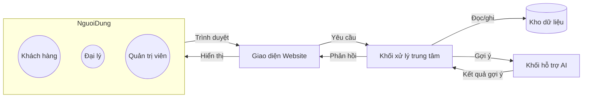
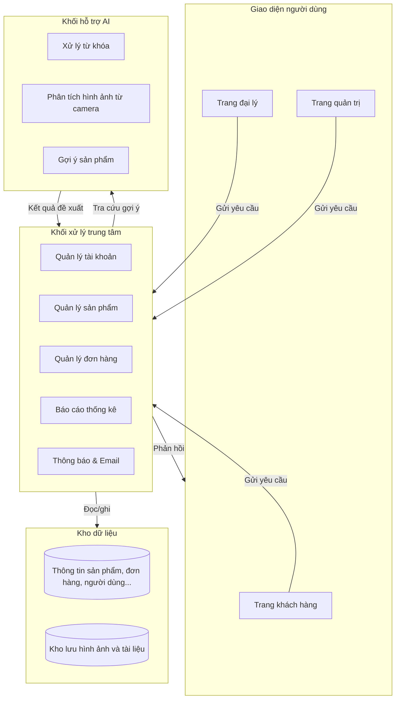
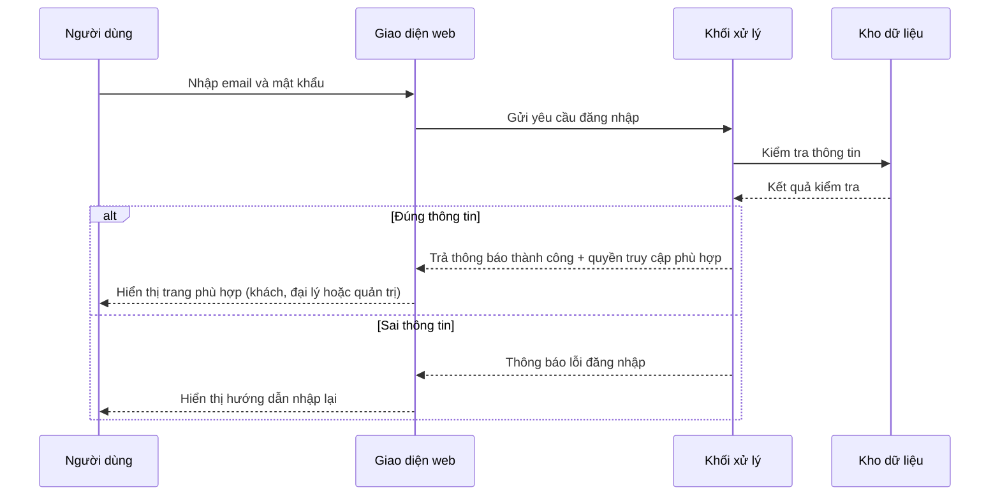
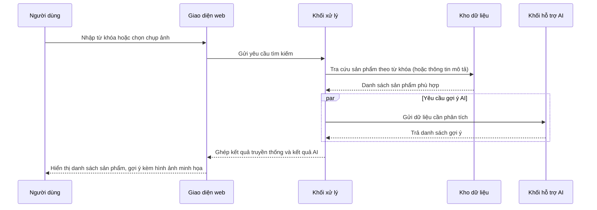
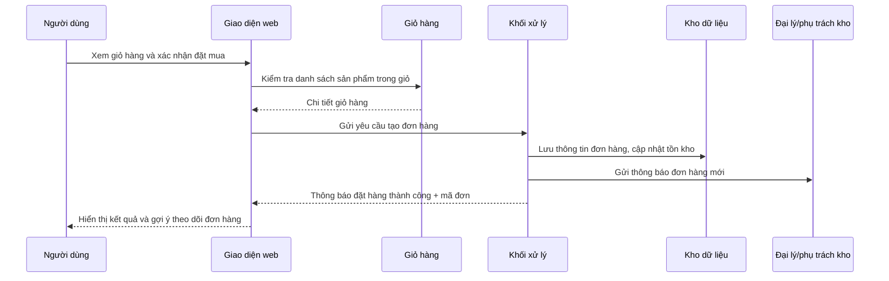
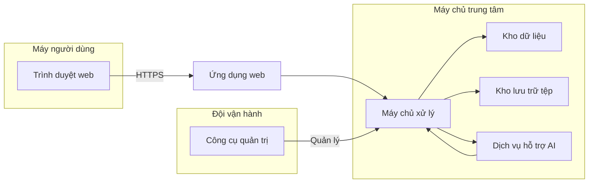

# BỘ GIÁO DỤC VÀ ĐÀO TẠO
# TRƯỜNG ĐẠI HỌC DUY TÂN

Tên đề tài: XÂY DỰNG WEBSITE BÁN HÀNG TÍCH HỢP AI TÌM KIẾM  
Tài liệu: ARCHITECTURE DOCUMENT  
GVHD: ……………….  
Nhóm SVTH: Nguyễn Văn A – 23211……; Nguyễn Thị B – 23211……; Lê Văn C – 23211……; ….

Đà Nẵng, tháng 4 năm 2021

---

## THÔNG TIN DỰ ÁN
- Dự án viết tắt: AI-Commerce
- Tên dự án: Xây dựng website bán hàng tích hợp AI tìm kiếm
- Ngày bắt đầu: 01/03/2021
- Ngày kết thúc: 20/05/2021
- Nơi thực hiện: Khoa Công nghệ Thông tin – Đại học Duy Tân
- Giảng viên hướng dẫn: ThS. …………… – Email: …………………. – Phone: ……………
- Chủ sở hữu: ThS. …………… – Email: …………………. – Phone: ……………
- Quản lý dự án: ....................@gmail.com – 090………. 
- Thành viên trong đội: theo danh sách nhóm SVTH

## THÔNG TIN TÀI LIỆU
- Tên dự án: Xây dựng website bán hàng tích hợp AI tìm kiếm
- Tiêu đề tài liệu: Architecture Document
- Người thực hiện: Võ Đỗ Văn Minh
- Phiên bản: 2.0
- Ngày phát hành: 11/11/2025

## LỊCH SỬ CHỈNH SỬA TÀI LIỆU
- Phiên bản 1.0 – 05/04/2021 – Tạo tài liệu
- Phiên bản 1.1 – 09/04/2021 – Chỉnh sửa nội dung
- Phiên bản 2.0 – 11/11/2025 – Cập nhật kiến trúc theo phần mềm hiện nay, bổ sung phần tìm kiếm AI và camera

## PHÊ DUYỆT TÀI LIỆU
- Người hướng dẫn: …………… – Chữ ký: __________ – Ngày: …./…./2021
- Chủ sở hữu: …………… – Chữ ký: __________ – Ngày: …./…./2021
- Quản lý dự án: …………… – Chữ ký: __________ – Ngày: …./…./2021
- Thành viên 1: …………… – Chữ ký: __________ – Ngày: …./…./2021
- Thành viên 2: …………… – Chữ ký: __________ – Ngày: …./…./2021
- Thành viên 3: …………… – Chữ ký: __________ – Ngày: …./…./2021

---

## MỤC LỤC
1.  GIỚI THIỆU................................................................................................................................. 4  
1.1.  Mục đích................................................................................................................................... 4  
1.2.  Tài liệu liên quan..................................................................................................................... 4  
2.  TỔNG QUAN............................................................................................................................... 5  
2.1.  Tổng quan dự án..................................................................................................................... 5  
2.2.  Bối cảnh dự án......................................................................................................................... 5  
2.3.  Mục tiêu dự kiến..................................................................................................................... 6  
2.4.  Các sơ đồ liên kết.................................................................................................................... 6  
3.  CÁC YẾU TỐ TÁC ĐỘNG ĐẾN CẤU TRÚC............................................................................. 8  
3.1.  Yêu cầu về chức năng............................................................................................................. 8  
3.2.  Các hạn chế về kinh doanh..................................................................................................... 9  
3.3.  Các hạn chế về kỹ thuật........................................................................................................ 10  
3.4.  Các thuộc tính chất lượng..................................................................................................... 10  
3.5.  Rủi ro kiến trúc..................................................................................................................... 11  
4.  TỔNG QUAN VỀ CẤU TRÚC.................................................................................................. 12  
4.1.  Tổng quan về cấu trúc thành phần....................................................................................... 12  
4.2.  Luồng nghiệp vụ tiêu biểu.................................................................................................... 13  
4.3.  Bảng mô tả luồng.................................................................................................................. 15  
5.  MODULE VIEW......................................................................................................................... 16  
5.1.  Sơ đồ phân rã chức năng...................................................................................................... 16  
5.2.  Bảng mô tả thành phần chính............................................................................................... 17  
5.3.  Liên kết chức năng – thành phần.......................................................................................... 18  
6.  ALLOCATION VIEW................................................................................................................ 19  
6.1.  Sơ đồ triển khai tổng quát.................................................................................................... 19  
6.2.  Mô tả chi tiết môi trường..................................................................................................... 20  
7.  KẾ HOẠCH TRIỂN KHAI AI TÌM KIẾM.................................................................................. 21  
7.1.  Kiến trúc giai đoạn 1 – Tìm kiếm văn bản.......................................................................... 21  
7.2.  Kiến trúc giai đoạn 2 – Tìm kiếm bằng camera.................................................................. 22  
8.  PHỤ LỤC.................................................................................................................................. 23  
8.1.  Bảng thuật ngữ..................................................................................................................... 23  
8.2.  Danh sách biểu đồ............................................................................................................... 24  
8.3.  Liên kết tài liệu tham khảo.................................................................................................. 24

---

## 1.  GIỚI THIỆU

### 1.1.  Mục đích
- Trình bày bức tranh tổng thể về kiến trúc hệ thống ở mức khái quát, nêu rõ các thành phần, mối liên kết, luồng thông tin và nhiệm vụ chính.
- Cung cấp nền tảng để đội dự án thống nhất hướng phát triển, làm cơ sở cho các tài liệu chi tiết, kiểm thử và bàn giao.
- Đảm bảo những người tham gia (nhà phát triển, thiết kế, kiểm thử, quản lý) nắm được cấu trúc chung trước khi triển khai.

### 1.2.  Tài liệu liên quan
- Đề cương dự án (Project Proposal).
- Kế hoạch dự án (Project Plan).
- Bảng yêu cầu người dùng (Product Backlog).
- Tài liệu hướng dẫn sử dụng và các bộ mẫu giao diện.

---

## 2.  TỔNG QUAN

### 2.1.  Tổng quan dự án
- Website thương mại điện tử hướng đến việc hỗ trợ khách hàng tìm kiếm, tham khảo, mua sắm sản phẩm một cách thuận tiện.
- Hệ thống cho phép quản trị viên và các đại lý thao tác trên kho sản phẩm, khuyến mãi, đơn hàng và thống kê.
- Điểm khác biệt của dự án là tích hợp tìm kiếm thông minh dựa trên AI, bao gồm tìm kiếm theo từ khóa nâng cao và tìm kiếm bằng hình ảnh từ camera.

### 2.2.  Bối cảnh dự án
- Dự án phục vụ hoạt động thực hành tại Khoa Công nghệ Thông tin – Đại học Duy Tân, đồng thời có khả năng triển khai thực tế cho doanh nghiệp vừa và nhỏ.
- Người dùng truy cập qua trình duyệt phổ biến trên máy tính cá nhân; môi trường vận hành dự kiến là nền tảng web đơn giản, dễ triển khai.
- Việc tích hợp AI được định hướng theo từng giai đoạn, đảm bảo hạ tầng sẵn sàng cho việc mở rộng trong tương lai.

### 2.3.  Mục tiêu dự kiến
- Hoàn thiện đầy đủ các chức năng mua sắm: đăng ký, đăng nhập, đặt hàng, quản lý giỏ hàng, xem hóa đơn, đánh giá sản phẩm.
- Hỗ trợ quản trị: quản lý danh mục, sản phẩm, khuyến mãi, người dùng, phân quyền, thống kê doanh thu.
- Hỗ trợ đại lý: quản lý hàng nhập, tồn kho, lịch sử bán hàng, báo cáo riêng cho đại lý.
- Tích hợp tìm kiếm AI: trước mắt là tìm kiếm bằng từ khóa thông minh; mở rộng thêm giai đoạn tìm kiếm hình ảnh thông qua camera và gợi ý sản phẩm.

### 2.4.  Các sơ đồ liên kết

**Hình 1 – Sơ đồ ngữ cảnh hệ thống.** Sơ đồ mô tả các nhóm người dùng truy cập vào giao diện website, gửi yêu cầu đến khối xử lý trung tâm. Khối này làm việc với kho dữ liệu và khối hỗ trợ AI để trả kết quả về cho người dùng.

---

## 3.  CÁC YẾU TỐ TÁC ĐỘNG ĐẾN CẤU TRÚC

### 3.1.  Yêu cầu về chức năng
| ID  | Tên chức năng              | Mô tả ngắn                                                                 |
|-----|----------------------------|----------------------------------------------------------------------------|
| PB01| Đăng nhập                  | Người dùng đăng nhập bằng email và mật khẩu tương ứng với vai trò của mình |
| PB02| Đăng ký                    | Người dùng cung cấp thông tin cá nhân, xác nhận email để kích hoạt tài khoản|
| PB03| Xem thông tin hệ thống     | Khách tham quan xem danh mục, sản phẩm, tin khuyến mãi, tin tức            |
| PB04| Tìm kiếm nâng cao          | Tìm kiếm theo từ khóa, hiển thị gợi ý; chuẩn bị tích hợp tìm kiếm bằng camera|
| PB05| Mua hàng                   | Chọn sản phẩm, xác nhận đơn, theo dõi tình trạng giao hàng                 |
| PB06| Giỏ hàng                   | Lưu sản phẩm, chỉnh sửa số lượng, xóa sản phẩm trước khi đặt đơn          |
| PB07| Xem hóa đơn                | Tra cứu đơn đã đặt, thông tin giao nhận, xuất file xác nhận               |
| PB08| Lấy lại mật khẩu           | Gửi yêu cầu qua email, đặt lại mật khẩu thông qua đường dẫn riêng          |
| PB09| Đổi mật khẩu               | Đổi mật khẩu an toàn trong trang cá nhân sau khi xác thực                 |
| PB10| Tài khoản cá nhân          | Cập nhật thông tin liên hệ, địa chỉ giao hàng, hình đại diện              |
| PB11| Quản lý tài khoản          | Quản trị viên và nhân viên quản lý danh sách người dùng, phân quyền       |
| PB12| Quản lý sản phẩm           | Thêm mới, chỉnh sửa, ẩn/hiện sản phẩm, gán vào danh mục                  |
| PB13| Quản lý hóa đơn            | Theo dõi, điều chỉnh, duyệt hóa đơn, cập nhật trạng thái thanh toán       |
| PB14| Thống kê                   | Tổng hợp doanh thu theo thời gian, biểu đồ tăng trưởng, top sản phẩm      |

### 3.2.  Các hạn chế về kinh doanh
- Thời gian triển khai ngắn (giữa học kỳ), nguồn lực hạn chế trong phạm vi nhóm sinh viên.
- Không sử dụng phần mềm thương mại trả phí; ưu tiên giải pháp mở hoặc miễn phí.
- Cần bàn giao sản phẩm hoàn chỉnh để phục vụ báo cáo, sau đó tiếp tục hoàn thiện dựa trên phản hồi.

### 3.3.  Các hạn chế về kỹ thuật
- Hệ thống chạy trên nền web, yêu cầu hoạt động ổn định trên trình duyệt phổ biến của máy tính để bàn.
- Môi trường máy chủ dự kiến sử dụng nền tảng mã nguồn mở, cơ sở dữ liệu quan hệ, không phụ thuộc phần cứng chuyên dụng.
- Việc tích hợp AI cần tuân thủ hạn mức sử dụng dịch vụ (nếu sử dụng nền tảng đám mây), tối ưu chi phí và độ trễ.

### 3.4.  Các thuộc tính chất lượng
| Thuộc tính          | Mô tả kịch bản mong muốn                                                                      | Mức ưu tiên | Biện pháp đảm bảo                                                                 |
|---------------------|------------------------------------------------------------------------------------------------|-------------|-----------------------------------------------------------------------------------|
| Bảo mật             | Thông tin cá nhân, đơn hàng và thanh toán cần được bảo vệ, phân quyền rõ ràng                | Cao         | Mã hóa mật khẩu, kiểm soát đăng nhập theo vai trò, nhật ký hành động             |
| Khả dụng            | Hệ thống luôn sẵn sàng trong giờ làm việc, tránh gián đoạn dịch vụ                          | Cao         | Sao lưu định kỳ, triển khai trên máy chủ ổn định, giám sát trạng thái            |
| Hiệu năng           | Tra cứu sản phẩm hiển thị nhanh, thống kê không gây treo hệ thống                           | Trung bình  | Tối ưu truy vấn, phân trang, chuẩn bị dữ liệu nổi bật                            |
| Khả mở rộng         | Dễ dàng thêm chức năng tìm kiếm mới, mở thêm nhóm người dùng                               | Cao         | Tách riêng khối hỗ trợ AI, chuẩn hóa giao diện kết nối, ghi nhận log chuẩn      |
| Dễ bảo trì           | Thành viên mới đọc tài liệu là có thể tiếp tục phát triển                                    | Trung bình  | Giữ cấu trúc rõ ràng, tài liệu cập nhật theo từng phiên bản                     |
| Trải nghiệm người dùng | Người dùng thao tác ít bước, giao diện thân thiện với nhiều đối tượng                    | Cao         | Thiết kế giao diện thống nhất, hướng dẫn thao tác, phản hồi lỗi rõ ràng         |

### 3.5.  Rủi ro kiến trúc
- Việc tích hợp AI phụ thuộc vào dịch vụ bên ngoài, có thể phát sinh chi phí hoặc giới hạn sử dụng.
- Dữ liệu người dùng và đơn hàng tăng nhanh, nếu không tối ưu sẽ ảnh hưởng tốc độ hệ thống.
- Quản trị tài khoản cần chú trọng bảo mật, tránh lộ thông tin đăng nhập hoặc cấp sai quyền hạn.

---

## 4.  TỔNG QUAN VỀ CẤU TRÚC

### 4.1.  Tổng quan về cấu trúc thành phần

**Hình 2 – Sơ đồ các thành phần chính.** Sơ đồ cho thấy các khối chức năng chính của hệ thống và cách thức chúng giao tiếp với nhau.

### 4.2.  Luồng nghiệp vụ tiêu biểu

**Hình 3 – Luồng đăng nhập.** Biểu đồ mô tả các bước kiểm tra thông tin đăng nhập và phản hồi tới người dùng.


**Hình 4 – Luồng tìm kiếm và gợi ý AI.** Biểu đồ thể hiện việc kết hợp tìm kiếm thông thường và gợi ý thông minh.


**Hình 5 – Luồng đặt hàng.** Biểu đồ mô tả cách hệ thống tạo đơn hàng, cập nhật kho và thông báo cho các bên liên quan.

---

## 5.  MODULE VIEW

### 5.1.  Phân rã mức cao
- **Khối giao diện người dùng:** Bao gồm trang chủ, trang tìm kiếm, trang giỏ hàng, trang dành cho đại lý và trang quản trị. Các trang chia sẻ bộ khung giao diện chung, bố trí theo từng loại người dùng.
- **Khối xử lý nghiệp vụ:** Gồm các nhóm chức năng chính: quản lý tài khoản, quản lý sản phẩm, quản lý đơn hàng, thống kê báo cáo, gửi thông báo/email.
- **Khối dữ liệu:** Bao gồm các bảng lưu thông tin danh mục, sản phẩm, đơn hàng, khách hàng, đại lý, đánh giá, lịch sử giao dịch, và vùng lưu trữ dữ liệu phục vụ AI (nhật ký tìm kiếm, hình ảnh mẫu).
- **Khối hỗ trợ AI:** Chuẩn bị dữ liệu mô tả sản phẩm (từ khóa, mô tả, hình ảnh), kết nối với mô-đun gợi ý để xử lý yêu cầu tìm kiếm thông minh, đặc biệt là tìm kiếm bằng camera.

### 5.2.  Sơ đồ phân rã chức năng

```mermaid
flowchart TD
    HeThong[Hệ thống bán hàng tích hợp AI] --> GiaoDien[Giao diện người dùng]
    HeThong --> XuLyNghiepVu[Khối xử lý nghiệp vụ]
    HeThong --> DuLieu[Kho dữ liệu]
    HeThong --> AIHoTro[Khối hỗ trợ AI]

    GiaoDien --> TrangChinh[Trang nội dung chung]
    GiaoDien --> TrangMuaSam[Trang mua sắm]
    GiaoDien --> TrangDaiLy[Trang dành cho đại lý]
    GiaoDien --> TrangQuanTri[Trang quản trị]

    XuLyNghiepVu --> TaiKhoan[Quản lý tài khoản]
    XuLyNghiepVu --> SanPham[Quản lý sản phẩm]
    XuLyNghiepVu --> DonHang[Quản lý đơn hàng]
    XuLyNghiepVu --> ThongKe[Báo cáo và thống kê]
    XuLyNghiepVu --> ThongBao[Thông báo & email]

    DuLieu --> BangSanPham[Bảng sản phẩm]
    DuLieu --> BangDonHang[Bảng đơn hàng]
    DuLieu --> BangNguoiDung[Bảng người dùng]
    DuLieu --> BangDaiLy[Bảng đại lý]
    DuLieu --> LuuAnh[Lưu hình ảnh]

    AIHoTro --> XuLyTuKhoa[Xử lý dữ liệu từ khóa]
    AIHoTro --> XuLyAnh[Xử lý hình ảnh]
    AIHoTro --> GoiYXuHuong[Đề xuất sản phẩm xu hướng]
```

**Hình 6 – Sơ đồ phân rã chức năng.** Sơ đồ nêu rõ cách hệ thống được chia thành các khối chức năng và nhiệm vụ cụ thể của từng khối.

### 5.3.  Bảng mô tả chi tiết
| Bước | Mô tả                                                                                                    |
|------|-----------------------------------------------------------------------------------------------------------|
| 1    | Người dùng gửi yêu cầu (xem sản phẩm, tìm kiếm, đăng nhập, đặt hàng) từ trình duyệt                      |
| 2    | Hệ thống ghi nhận yêu cầu, kiểm tra thông tin đầu vào                                                     |
| 3    | Các chức năng nghiệp vụ xử lý yêu cầu, truy xuất dữ liệu, kiểm tra điều kiện kinh doanh                  |
| 4    | Nếu cần, hệ thống chuyển yêu cầu sang kho dữ liệu để đọc/ghi thông tin                                   |
| 5    | Dữ liệu trả về được tổng hợp, bổ sung thông tin trình bày                                                  |
| 6    | Dịch vụ gợi ý AI được gọi để làm phong phú kết quả tìm kiếm (nếu liên quan)                              |
| 7    | Kết quả cuối cùng được trả về giao diện người dùng                                                        |

### 5.4.  Liên kết chức năng – thành phần
| Chức năng                     | Thành phần chính tham gia                       | Mô tả tóm tắt                                                               |
|-------------------------------|--------------------------------------------------|-------------------------------------------------------------------------------|
| Đăng nhập/Đăng ký            | Giao diện – Khối xử lý – Kho dữ liệu            | Tiếp nhận thông tin, kiểm tra, lưu dữ liệu người dùng                        |
| Tìm kiếm sản phẩm            | Giao diện – Khối xử lý – Kho dữ liệu – Khối AI  | Kết hợp tra cứu truyền thống và gợi ý AI                                     |
| Quản lý đơn hàng             | Giao diện – Khối xử lý – Kho dữ liệu – Đại lý    | Theo dõi trạng thái đơn, cập nhật kho, gửi thông báo                        |
| Quản lý thống kê             | Giao diện quản trị – Khối xử lý – Kho dữ liệu    | Tổng hợp doanh thu, biểu đồ xu hướng                                       |
| Hỗ trợ đại lý                | Giao diện đại lý – Khối xử lý – Kho dữ liệu      | Đại lý cập nhật hàng hóa, theo dõi đơn, kết nối với khách hàng khu vực       |

---

## 6.  ALLOCATION VIEW

### 6.1.  Mô tả tổng quát

**Hình 7 – Sơ đồ triển khai.** Sơ đồ cho thấy vị trí các thành phần khi triển khai thực tế: máy người dùng, máy chủ xử lý, kho dữ liệu, kho lưu trữ và dịch vụ AI hỗ trợ.

### 6.2.  Mô tả chi tiết
- **Người dùng cuối:** Khách hàng, đại lý, quản trị viên truy cập bằng trình duyệt từ máy tính cá nhân.
- **Máy chủ ứng dụng:** Tiếp nhận tất cả yêu cầu, thực hiện các nghiệp vụ bán hàng, quản lý tài khoản, gọi tới dịch vụ AI khi cần.
- **Kho dữ liệu:** Lưu trữ thông tin sản phẩm, đơn hàng, người dùng, lịch sử giao dịch, nhật ký thao tác.
- **Dịch vụ AI tìm kiếm:** Xử lý dữ liệu văn bản và hình ảnh, cung cấp gợi ý sản phẩm phù hợp, hỗ trợ tính năng tìm kiếm bằng camera.
- **Kho lưu trữ tệp:** Lưu trữ hình ảnh sản phẩm, hình chụp từ camera, tài liệu hướng dẫn, các biểu mẫu phục vụ báo cáo.
- **Công cụ quản trị:** Giúp đội vận hành theo dõi tình trạng hệ thống, thực hiện sao lưu và xử lý sự cố khi cần.

---

## 7.  KẾ HOẠCH TRIỂN KHAI AI TÌM KIẾM

### 7.1.  Kiến trúc giai đoạn 1 – Tìm kiếm văn bản
| Bước | Nội dung thực hiện                                           | Mục tiêu đạt được                                                  |
|------|---------------------------------------------------------------|--------------------------------------------------------------------|
| 1    | Hoàn thiện chức năng tìm kiếm theo từ khóa                    | Khách hàng dễ dàng tìm sản phẩm theo tên, mô tả                    |
| 2    | Bổ sung gợi ý từ khóa nổi bật                                | Gợi ý các từ khóa phổ biến ngay khi người dùng nhập                |
| 3    | Lưu lại lịch sử tìm kiếm                                     | Hiểu xu hướng tìm kiếm để cải thiện danh mục và gợi ý             |
| 4    | Tối ưu giao diện hiển thị kết quả                             | Kết quả rõ ràng, cho phép lọc nhanh theo danh mục, mức giá        |

### 7.2.  Kiến trúc giai đoạn 2 – Tìm kiếm bằng camera
```mermaid
flowchart LR
    Cam[Camera/Thiết bị chụp hình] --> ThuThap[Thu thập hình ảnh]
    ThuThap --> TienXuLy[Tiền xử lý (cắt, giảm nhiễu)]
    TienXuLy --> PhanTich[Phân tích đặc trưng hình ảnh]
    PhanTich --> TraCuu[Đối chiếu với kho hình ảnh sản phẩm]
    TraCuu --> GoiY[Kết hợp gợi ý từ dữ liệu văn bản]
    GoiY --> PhanHoi[Trả kết quả về giao diện]
```
**Hình 8 – Quy trình tìm kiếm bằng camera.** Sơ đồ mô tả các bước từ khi người dùng chụp ảnh đến khi nhận được kết quả.

| Bước | Hành động                                                                 | Kết quả mong đợi                                                     |
|------|-----------------------------------------------------------------------------|-----------------------------------------------------------------------|
| 1    | Người dùng mở tính năng camera, chụp ảnh sản phẩm                          | Hệ thống nhận được hình ảnh rõ nét                                    |
| 2    | Hình ảnh được tiền xử lý (xoay, cắt, tối ưu ánh sáng)                       | Sẵn sàng cho bước phân tích                                           |
| 3    | Hệ thống phân tích điểm đặc trưng (màu sắc, hình dạng)                      | Tạo ra “dấu vân tay” của sản phẩm                                     |
| 4    | Đối chiếu với kho hình ảnh đã lưu                                          | Tìm các sản phẩm trùng hoặc tương tự                                  |
| 5    | Kết hợp dữ liệu văn bản (từ khóa, mô tả)                                   | Tăng độ chính xác khi gợi ý                                           |
| 6    | Trả kết quả lên giao diện người dùng                                      | Hiển thị danh sách sản phẩm, cho phép đặt hàng ngay                   |

---

## 8.  PHỤ LỤC

### 8.1.  Bảng thuật ngữ
| Thuật ngữ       | Giải thích                                                                 |
|-----------------|-----------------------------------------------------------------------------|
| Khách hàng      | Người truy cập website để xem và mua sản phẩm                              |
| Đại lý          | Đối tác cung cấp sản phẩm, cập nhật thông tin hàng hóa của riêng mình      |
| Quản trị viên   | Người chịu trách nhiệm điều hành, phê duyệt, giám sát hoạt động hệ thống   |
| Gợi ý AI        | Kết quả đề xuất sản phẩm nhờ vào phân tích dữ liệu thông minh              |
| Kho dữ liệu     | Nơi lưu trữ thông tin sản phẩm, đơn hàng, người dùng                       |

### 8.2.  Danh sách biểu đồ
| Hình | Tên biểu đồ                                | Mục đích mô tả                                                    |
|------|---------------------------------------------|------------------------------------------------------------------|
| 1    | Sơ đồ ngữ cảnh hệ thống                     | Thể hiện các tác nhân và tương tác tổng quát                     |
| 2    | Sơ đồ các thành phần chính                  | Cho thấy cấu trúc lớp của hệ thống                              |
| 3    | Luồng đăng nhập                              | Mô tả các bước kiểm tra thông tin người dùng                    |
| 4    | Luồng tìm kiếm và gợi ý AI                   | Mô tả kết hợp tìm kiếm truyền thống và AI                        |
| 5    | Luồng đặt hàng                               | Mô tả việc tạo đơn, cập nhật kho, thông báo cho đại lý           |
| 6    | Sơ đồ phân rã chức năng                      | Tổng quan các khối chức năng của hệ thống                       |
| 7    | Sơ đồ triển khai                             | Thể hiện môi trường triển khai hệ thống                         |
| 8    | Quy trình tìm kiếm bằng camera               | Minh họa các bước xử lý hình ảnh cho tìm kiếm nâng cao           |

### 8.3.  Liên kết tài liệu tham khảo
- Đề cương dự án, kế hoạch triển khai chi tiết, danh sách yêu cầu người dùng.
- Tài liệu hướng dẫn vận hành hệ thống đặt hàng và quản trị.
- Hướng dẫn sử dụng tính năng tìm kiếm AI và tích hợp camera (bản thuyết minh).

---

**Ghi chú:** Tài liệu này phản ánh trạng thái hệ thống tính đến ngày 11/11/2025. Khi mở rộng chức năng (đặc biệt là các hạng mục AI và camera), đội dự án cần điều chỉnh lại phần mô tả và sơ đồ để bảo đảm sự chính xác.
