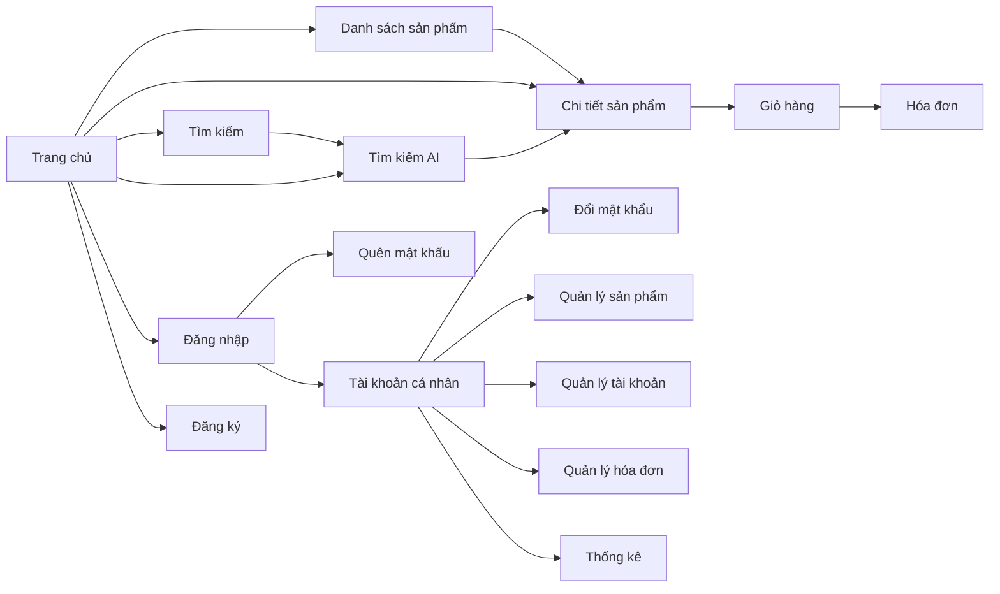

# BỘ GIÁO DỤC VÀ ĐÀO TẠO
# TRƯỜNG ĐẠI HỌC DUY TÂN

Tên đề tài: **XÂY DỰNG WEBSITE BÁN HÀNG TÍCH HỢP AI TÌM KIẾM**

Tài liệu: **THIẾT KẾ GIAO DIỆN (UI DESIGN DOCUMENT)**

GVHD: ……………….

Nhóm SVTH: ……………….

Địa điểm: Đà Nẵng, tháng 4 năm 2021

---

## 1. Sơ đồ liên kết giao diện

### 1.1. Sơ đồ tổng quan các trang giao diện

*Hình 1: Sơ đồ liên kết giữa các trang giao diện chính cho phép nhóm dự án hình dung cách người dùng chuyển đổi qua lại.*

### 1.2. Bảng mã giao diện

| Mã UI | Tên giao diện           | Ý nghĩa mô tả                                                           |
|:-----:|-------------------------|-------------------------------------------------------------------------|
| UI_01 | Trang chủ               | Màn hình giới thiệu, điều hướng tới các tính năng chính của cửa hàng. |
| UI_02 | Danh sách sản phẩm      | Trình bày các sản phẩm kèm bộ lọc danh mục.                            |
| UI_03 | Chi tiết sản phẩm       | Hiển thị thông tin chi tiết, hình ảnh và tùy chọn mua hàng.            |
| UI_04 | Tìm kiếm                | Cho phép nhập từ khóa để tìm sản phẩm.                                 |
| UI_05 | Tìm kiếm AI             | Tìm sản phẩm bằng hình ảnh hoặc camera.                                |
| UI_06 | Đăng nhập               | Nhập thông tin tài khoản để truy cập hệ thống.                         |
| UI_07 | Quên mật khẩu           | Nhận mã khôi phục qua email.                                           |
| UI_08 | Đăng ký                 | Đăng ký tài khoản người dùng mới.                                      |
| UI_09 | Giỏ hàng                | Hiển thị, chỉnh sửa các sản phẩm đã chọn mua.                          |
| UI_10 | Hóa đơn                 | Xem lịch sử đặt hàng và hóa đơn chi tiết.                              |
| UI_11 | Tài khoản cá nhân       | Quản lý thông tin, truy cập các chức năng cho thành viên.              |
| UI_12 | Đổi mật khẩu            | Thay đổi mật khẩu tài khoản.                                           |
| UI_13 | Quản lý sản phẩm        | Màn hình quản trị cập nhật thông tin sản phẩm.                         |
| UI_14 | Quản lý tài khoản       | Quản trị người dùng và phân quyền.                                     |
| UI_15 | Quản lý hóa đơn         | Theo dõi và xử lý hóa đơn bán hàng.                                    |
| UI_16 | Thống kê                | Báo cáo trực quan về doanh thu, sản phẩm, khách hàng.                  |

---

## 2. Thiết kế giao diện chi tiết

> Mỗi mục dưới đây bao gồm hình ảnh mẫu (dạng minh họa), mô tả tổng quan và bảng đặc tả để nhóm triển khai bám sát khi phát triển.

### 2.1. Giao diện trang chủ (UI_01)

#### 2.1.1. Bảng mẫu

*Hình 2: Bố cục trang chủ với thanh điều hướng, vùng banner và lối tắt đến các chức năng chính.*

#### 2.1.2. Đặc tả chi tiết

| Thuộc tính | Nội dung mô tả                               |
|-----------:|-----------------------------------------------|
| Màn hình   | Trang chủ                                    |
| Mô tả      | Khách hàng xem thông tin tổng quan và lối tắt |
| Truy cập   | Người dùng bấm “Home” trên thanh điều hướng   |
| Đối tượng  | Tất cả người dùng                             |

**Nội dung thành phần**

| Mục | Kiểu hiển thị | Dữ liệu mặc định | Mô tả chức năng                                          |
|:---:|----------------|------------------|----------------------------------------------------------|
| 1   | Link label     | Logo/“Home”      | Dẫn về trang chủ                                         |
| 2   | Link label     | “Store”          | Dẫn tới `Danh sách sản phẩm`                            |
| 3   | Link label     | “Cart”           | Dẫn tới `Giỏ hàng`                                       |
| 4   | Link label     | “About”          | Giới thiệu về cửa hàng                                  |
| 5   | Icon button    | Camera           | Mở `Tìm kiếm AI`                                         |
| 6   | Button         | Biểu tượng kính lúp | Tìm kiếm bằng từ khóa                              |
| 7   | Link label     | “Log in”         | Dẫn tới `Đăng nhập`                                      |
| 8   | Link label     | “Sign up”        | Dẫn tới `Đăng ký`                                        |
| 9   | Image          | Banner sản phẩm  | Thu hút khách chú ý đến khuyến mại                      |

**Hoạt động người dùng**

| Tên hoạt động | Mô tả thao tác                                          | Kết quả thành công                     | Kết quả thất bại                               |
|---------------|---------------------------------------------------------|----------------------------------------|------------------------------------------------|
| Home          | Chọn menu “Home”                                        | Hiển thị lại trang chủ                 | Trang chủ không tải, thông báo lỗi             |
| Store         | Chọn menu “Store”                                       | Hiển thị danh sách sản phẩm            | Trang không hiển thị                          |
| Cart          | Chọn menu “Cart”                                        | Mở trang giỏ hàng                      | Không hiển thị giỏ hàng                        |
| Camera        | Nhấn biểu tượng camera                                  | Mở trang `Tìm kiếm AI`                 | Không mở được trang tìm kiếm AI                |
| Tìm kiếm      | Nhập từ khóa và nhấn biểu tượng kính lúp                | Hiển thị sản phẩm phù hợp              | Thông báo “Sản phẩm không tồn tại”             |
| Sign up       | Nhấn liên kết “Sign up”                                  | Mở trang đăng ký                       | Không hiển thị trang đăng ký                   |

---

### 2.2. Giao diện danh sách sản phẩm (UI_02)

#### 2.2.1. Bảng mẫu

*Hình 3: Trang danh sách với thanh lọc theo danh mục và phân trang sản phẩm.*

#### 2.2.2. Đặc tả chi tiết

| Thuộc tính | Nội dung mô tả                                   |
|-----------:|---------------------------------------------------|
| Màn hình   | Danh sách sản phẩm                               |
| Mô tả      | Cho phép khách hàng duyệt toàn bộ sản phẩm        |
| Truy cập   | Người dùng bấm “Store” hoặc chọn danh mục bất kỳ |
| Đối tượng  | Khách hàng                                        |

**Nội dung thành phần**

| Mục | Kiểu hiển thị | Dữ liệu mặc định | Mô tả chức năng                             |
|:---:|----------------|------------------|---------------------------------------------|
| 1   | Breadcrumbs   | Home / Store     | Hiển thị đường dẫn hiện tại                 |
| 2   | Listbox       | Danh mục sản phẩm| Lọc sản phẩm theo nhóm                      |
| 3   | Image + Card  | Ảnh sản phẩm     | Hiển thị ảnh, tên, giá và nút xem chi tiết  |
| 4   | Pagination    | Trang 1          | Chuyển trang khi có nhiều sản phẩm          |

**Hoạt động người dùng**

| Tên hoạt động  | Mô tả thao tác                                          | Kết quả thành công                    | Kết quả thất bại                          |
|----------------|---------------------------------------------------------|---------------------------------------|-------------------------------------------|
| Chọn danh mục  | Chọn một danh mục trong hộp danh sách                   | Hiển thị sản phẩm thuộc danh mục      | Không lọc được sản phẩm                   |
| Xem chi tiết   | Nhấn vào thẻ sản phẩm                                   | Mở trang `Chi tiết sản phẩm`          | Không mở được chi tiết                    |
| Chuyển trang   | Nhấn nút chuyển trang                                   | Hiển thị sản phẩm trang tiếp theo     | Trang không đổi                           |

---

### 2.3. Giao diện chi tiết sản phẩm (UI_03)

#### 2.3.1. Bảng mẫu

*Hình 4: Trang chi tiết sản phẩm với thông tin, lựa chọn màu, size và hành động mua.*

#### 2.3.2. Đặc tả chi tiết

| Thuộc tính | Nội dung mô tả                                      |
|-----------:|------------------------------------------------------|
| Màn hình   | Chi tiết sản phẩm                                    |
| Mô tả      | Hiển thị thông tin và cho phép đặt hàng              |
| Truy cập   | Người dùng chọn “Chi tiết sản phẩm” từ danh sách     |
| Đối tượng  | Khách hàng                                           |

**Nội dung thành phần**

| Mục | Kiểu hiển thị  | Dữ liệu mặc định | Mô tả chức năng                                      |
|:---:|-----------------|------------------|------------------------------------------------------|
| 1   | Image gallery   | Ảnh sản phẩm     | Xem ảnh minh họa                                     |
| 2   | Textfield       | Thông tin mô tả  | Ngắn gọn mô tả sản phẩm                              |
| 3   | Color picker    | Mặc định màu đầu | Chọn màu sắc                                         |
| 4   | Combobox        | Mặc định Size S  | Chọn kích thước                                      |
| 5   | Number stepper  | Mặc định 1       | Chọn số lượng mua                                    |
| 6   | Button          | “Add to cart”    | Thêm sản phẩm vào giỏ                                |
| 7   | Button          | “Buy now”        | Mở quy trình mua ngay                                |

**Hoạt động người dùng**

| Tên hoạt động | Mô tả thao tác                                 | Kết quả thành công              | Kết quả thất bại                             |
|---------------|------------------------------------------------|---------------------------------|----------------------------------------------|
| Add to cart   | Nhấn nút “Add to cart”                         | Sản phẩm vào giỏ hàng          | Thông báo lỗi, không thêm được               |
| Buy now       | Nhấn nút “Buy now”                             | Mở giao diện mua hàng          | Không điều hướng, thông báo lỗi              |
| Chọn màu      | Chọn màu từ bảng lựa chọn                      | Cập nhật màu đang chọn         | Không đổi màu hiển thị                       |
| Chọn số lượng | Dùng nút +/- để điều chỉnh số lượng            | Cập nhật số lượng              | Không cập nhật, hiển thị cảnh báo            |

---

### 2.4. Giao diện tìm kiếm (UI_04)

#### 2.4.1. Bảng mẫu

*Hình 5: Hộp tìm kiếm từ khóa cùng gợi ý sản phẩm khi nhập dữ liệu.*

#### 2.4.2. Đặc tả chi tiết

| Thuộc tính | Nội dung mô tả                                           |
|-----------:|-----------------------------------------------------------|
| Màn hình   | Tìm kiếm                                                 |
| Mô tả      | Tìm sản phẩm theo từ khóa                                |
| Truy cập   | Người dùng nhấn biểu tượng kính lúp trên thanh điều hướng|
| Đối tượng  | Khách hàng                                               |

**Nội dung thành phần**

| Mục | Kiểu hiển thị | Dữ liệu mặc định | Mô tả chức năng                          |
|:---:|----------------|------------------|------------------------------------------|
| 1   | Textbox        | Rỗng             | Nhập từ khóa tìm kiếm                    |
| 2   | Button         | Kính lúp         | Gửi yêu cầu tìm kiếm                     |
| 3   | Icon button    | Camera           | Mở trang `Tìm kiếm AI`                   |
| 4   | Image grid     | Rỗng             | Hiển thị sản phẩm khi có kết quả         |

**Hoạt động người dùng**

| Tên hoạt động | Mô tả thao tác                                      | Kết quả thành công             | Kết quả thất bại                                |
|---------------|-----------------------------------------------------|--------------------------------|-----------------------------------------------|
| Camera        | Nhấn biểu tượng camera                              | Mở trang `Tìm kiếm AI`         | Không chuyển trang                             |
| Tìm kiếm      | Nhập từ khóa, nhấn nút kính lúp                     | Hiển thị sản phẩm phù hợp      | Thông báo “Sản phẩm không tồn tại”            |

---

### 2.5. Giao diện tìm kiếm AI (UI_05)

#### 2.5.1. Bảng mẫu

*Hình 6: Trang tìm kiếm bằng hình ảnh cho phép tải ảnh hoặc mở camera.*

#### 2.5.2. Đặc tả chi tiết

| Thuộc tính | Nội dung mô tả                                              |
|-----------:|--------------------------------------------------------------|
| Màn hình   | Tìm kiếm AI                                                 |
| Mô tả      | Tìm sản phẩm bằng cách tải ảnh hoặc dùng camera              |
| Truy cập   | Người dùng nhấn biểu tượng camera hoặc chọn “Tìm kiếm AI”   |
| Đối tượng  | Khách hàng                                                  |

**Nội dung thành phần**

| Mục | Kiểu hiển thị | Dữ liệu mặc định | Mô tả chức năng                                 |
|:---:|----------------|------------------|-----------------------------------------------|
| 1   | Text area      | Rỗng             | Mô tả ngắn về ảnh được chọn                    |
| 2   | Button         | “Choose file”    | Chọn ảnh từ thiết bị                           |
| 3   | Button         | “Find product”   | Gửi ảnh để hệ thống phân tích                  |
| 4   | Image          | Rỗng             | Hiển thị ảnh/ sản phẩm phù hợp                 |
| 5   | Button         | “Add to cart”    | Thêm sản phẩm kết quả vào giỏ                  |

**Hoạt động người dùng**

| Tên hoạt động | Mô tả thao tác                                           | Kết quả thành công           | Kết quả thất bại                           |
|---------------|----------------------------------------------------------|------------------------------|--------------------------------------------|
| Choose file   | Nhấn nút “Choose file”, chọn ảnh                         | Ảnh được tải lên             | Không mở được cửa sổ chọn ảnh              |
| Find product  | Nhấn “Find product” sau khi có ảnh                       | Hiển thị sản phẩm tương tự  | Không có kết quả, thông báo lỗi            |
| Add to cart   | Nhấn “Add to cart” với sản phẩm được đề xuất             | Sản phẩm vào giỏ             | Không thêm được, thông báo lỗi             |

---

### 2.6. Giao diện đăng nhập (UI_06)

#### 2.6.1. Bảng mẫu

*Hình 7: Khung đăng nhập cho thành viên và quản trị.*

#### 2.6.2. Đặc tả chi tiết

| Thuộc tính | Nội dung mô tả                                                     |
|-----------:|---------------------------------------------------------------------|
| Màn hình   | Đăng nhập                                                          |
| Mô tả      | Thu thập tên đăng nhập, mật khẩu và phân loại người dùng           |
| Truy cập   | Nhấn nút “LOG IN” trên thanh điều hướng hoặc trang chủ             |
| Đối tượng  | Thành viên, quản trị                                               |

**Nội dung thành phần**

| Mục | Kiểu hiển thị | Dữ liệu mặc định | Yêu cầu | Mô tả chức năng                          |
|:---:|----------------|------------------|:-------:|------------------------------------------|
| 1   | Textbox        | Rỗng             | Có      | Nhập tên đăng nhập                        |
| 2   | Password box   | Rỗng             | Có      | Nhập mật khẩu                             |
| 3   | Button         | “LOG IN”         | -       | Gửi thông tin đăng nhập                   |
| 4   | Button         | “SIGN UP”        | -       | Chuyển sang trang đăng ký                 |
| 5   | Link label     | “Forgot password”| -       | Chuyển sang trang quên mật khẩu           |

**Hoạt động người dùng**

| Tên hoạt động         | Mô tả thao tác                               | Kết quả thành công                              | Kết quả thất bại                                      |
|-----------------------|----------------------------------------------|-------------------------------------------------|-------------------------------------------------------|
| Không nhập username   | Bỏ trống trường username, nhấn “LOG IN”      | -                                               | Thông báo “Vui lòng nhập username”                    |
| Không nhập password   | Bỏ trống mật khẩu, nhấn “LOG IN”             | -                                               | Thông báo “Vui lòng nhập password”                   |
| Đăng nhập             | Nhập đúng thông tin, nhấn “LOG IN”           | Mở trang `Tài khoản cá nhân`                     | Thông báo “Tài khoản hoặc mật khẩu không chính xác”   |
| Đăng ký               | Nhấn “SIGN UP”                               | Mở trang đăng ký                                | -                                                     |
| Quên mật khẩu         | Nhấn “Forgot password”                       | Mở trang `Quên mật khẩu`                         | -                                                     |

---

### 2.7. Giao diện quên mật khẩu (UI_07)

#### 2.7.1. Bảng mẫu

*Hình 8: Biểu mẫu nhập email để nhận mã khôi phục mật khẩu.*

#### 2.7.2. Đặc tả chi tiết

| Thuộc tính | Nội dung mô tả                                        |
|-----------:|--------------------------------------------------------|
| Màn hình   | Email lấy lại mật khẩu                                |
| Mô tả      | Nhập email và nhận mã xác nhận                         |
| Truy cập   | Người dùng chọn “Forgot password”                      |
| Đối tượng  | Khách hàng                                             |

**Nội dung thành phần**

| Mục | Kiểu hiển thị | Dữ liệu mặc định | Yêu cầu | Mô tả chức năng                          |
|:---:|----------------|------------------|:-------:|------------------------------------------|
| 1   | Textbox        | Rỗng             | Có      | Nhập địa chỉ email                        |
| 2   | Button         | “SEND CODE”      | -       | Gửi mã xác nhận                           |
| 3   | Button         | “CANCEL”         | -       | Thoát khỏi quy trình                      |

**Hoạt động người dùng**

| Tên hoạt động            | Mô tả thao tác                                 | Kết quả thành công                        | Kết quả thất bại                                       |
|--------------------------|------------------------------------------------|-------------------------------------------|--------------------------------------------------------|
| Không nhập email         | Bỏ trống email, nhấn “SEND CODE”               | -                                         | Thông báo “Vui lòng điền đầy đủ thông tin”             |
| Nhập sai định dạng email | Ví dụ nhập “Ag%$Sx.gmail.com”                 | -                                         | Thông báo “Bạn nhập sai định dạng, vui lòng thử lại”   |
| Send code                | Nhập đúng email, nhấn “SEND CODE”              | Gửi mã xác nhận qua email                 | Thông báo lỗi gửi không thành công                     |
| Cancel                   | Nhấn “CANCEL”                                  | Thoát về trang trước                      | Vẫn ở lại trang, hiển thị cảnh báo                     |

---

### 2.8. Giao diện đăng ký (UI_08)

#### 2.8.1. Bảng mẫu

*Hình 9: Biểu mẫu đăng ký tài khoản mới với các trường thông tin bắt buộc.*

#### 2.8.2. Đặc tả chi tiết

| Thuộc tính | Nội dung mô tả                                            |
|-----------:|------------------------------------------------------------|
| Màn hình   | Đăng ký                                                   |
| Mô tả      | Nhập thông tin cơ bản để tạo tài khoản                     |
| Truy cập   | Người dùng nhấn nút “SIGN UP” trên trang chủ hoặc đăng nhập|
| Đối tượng  | Người dùng mới                                            |

**Nội dung thành phần**

| Mục | Kiểu hiển thị | Dữ liệu mặc định | Yêu cầu | Mô tả chức năng                               |
|:---:|----------------|------------------|:-------:|-----------------------------------------------|
| 1   | Textbox        | Rỗng             | Có      | Nhập username                                 |
| 2   | Textbox        | Rỗng             | Có      | Nhập email                                    |
| 3   | Password box   | Rỗng             | Có      | Nhập mật khẩu                                 |
| 4   | Password box   | Rỗng             | Có      | Nhập lại mật khẩu                             |
| 5   | Button         | “SIGN UP”        | -       | Gửi yêu cầu đăng ký                           |

**Hoạt động người dùng**

| Tên hoạt động              | Mô tả thao tác                                | Kết quả thành công                                             | Kết quả thất bại                                               |
|----------------------------|-----------------------------------------------|----------------------------------------------------------------|----------------------------------------------------------------|
| Không nhập username        | Bỏ trống username, nhấn “SIGN UP”             | -                                                              | Thông báo “Vui lòng điền đầy đủ thông tin”                     |
| Không nhập password        | Bỏ trống password, nhấn “SIGN UP”             | -                                                              | Thông báo “Vui lòng điền đầy đủ thông tin”                     |
| Không nhập email           | Bỏ trống email, nhấn “SIGN UP”                | -                                                              | Thông báo “Vui lòng điền đầy đủ thông tin”                     |
| Không nhập lại password    | Bỏ trống confirm password, nhấn “SIGN UP”     | -                                                              | Thông báo “Vui lòng điền đầy đủ thông tin”                     |
| Nhập sai định dạng username| Ví dụ “ABC CH$A”                              | -                                                              | Thông báo “Bạn nhập sai định dạng, vui lòng nhập lại”          |
| Nhập sai định dạng password| Ví dụ “A$bcv % asd”                           | -                                                              | Thông báo “Bạn nhập sai định dạng, vui lòng nhập lại”          |
| Nhập sai định dạng email   | Ví dụ “Ag%$Sx.gmail.com”                      | -                                                              | Thông báo “Bạn nhập sai định dạng, vui lòng nhập lại”          |
| Đăng ký                    | Nhập hợp lệ, nhấn “SIGN UP”                   | Thông báo “Đăng ký thành công, vui lòng kiểm tra email”        | Thông báo “Tài khoản đã tồn tại, vui lòng nhập lại”           |

---

### 2.9. Giao diện giỏ hàng (UI_09)

#### 2.9.1. Bảng mẫu

*Hình 10: Danh sách sản phẩm trong giỏ, chọn/xóa, và tiếp tục mua.*

#### 2.9.2. Đặc tả chi tiết

| Thuộc tính | Nội dung mô tả                                     |
|-----------:|-----------------------------------------------------|
| Màn hình   | Giỏ hàng                                           |
| Mô tả      | Hiển thị sản phẩm đã chọn, cho phép chỉnh sửa       |
| Truy cập   | Người dùng bấm “Cart”                               |
| Đối tượng  | Khách hàng                                          |

**Nội dung thành phần**

| Mục | Kiểu hiển thị | Dữ liệu mặc định | Mô tả chức năng                                  |
|:---:|----------------|------------------|--------------------------------------------------|
| 1   | Grid view      | Danh sách sản phẩm| Thể hiện sản phẩm đã chọn và trạng thái thanh toán|
| 2   | Checkbox       | Bỏ chọn           | Chọn sản phẩm để thao tác                        |
| 3   | Button         | “Xóa”             | Xóa sản phẩm khỏi giỏ                            |
| 4   | Button         | “Tiếp tục mua”    | Quay lại danh sách sản phẩm                     |

**Hoạt động người dùng**

| Tên hoạt động | Mô tả thao tác                                 | Kết quả thành công                      | Kết quả thất bại                               |
|---------------|------------------------------------------------|-----------------------------------------|-----------------------------------------------|
| Xóa           | Chọn sản phẩm và nhấn “Xóa”                     | Sản phẩm bị loại khỏi giỏ               | Không xóa được, thông báo lỗi                 |
| Tiếp tục mua  | Nhấn “Tiếp tục mua”                             | Mở trang `Danh sách sản phẩm`           | Trang không thay đổi                          |
| Mua hàng      | Nhấn “Thanh toán” (nếu có)                      | Chuyển đến quy trình thanh toán         | Không chuyển trang, thông báo lỗi             |

---

### 2.10. Giao diện hóa đơn (UI_10)

#### 2.10.1. Bảng mẫu

*Hình 11: Danh sách hóa đơn với trạng thái, phương thức thanh toán và hành động xem chi tiết.*

#### 2.10.2. Đặc tả chi tiết

| Thuộc tính | Nội dung mô tả                                             |
|-----------:|-------------------------------------------------------------|
| Màn hình   | Hóa đơn                                                    |
| Mô tả      | Cho phép người dùng xem lịch sử đặt hàng và chi tiết hóa đơn|
| Truy cập   | Người dùng chọn mục “Hóa đơn” từ giỏ hàng hoặc tài khoản    |
| Đối tượng  | Khách hàng, quản trị                                       |

**Nội dung thành phần**

| Mục | Kiểu hiển thị | Dữ liệu mặc định | Mô tả chức năng                                   |
|:---:|----------------|------------------|---------------------------------------------------|
| 1   | Table          | Danh sách hóa đơn | Hiển thị mã, ngày, trạng thái, tổng tiền          |
| 2   | Button         | “Xem chi tiết”    | Mở chi tiết hóa đơn được chọn                     |
| 3   | Button         | “Tải PDF”         | Tải hóa đơn về máy                                |

**Hoạt động người dùng**

| Tên hoạt động | Mô tả thao tác                         | Kết quả thành công                         | Kết quả thất bại                           |
|---------------|----------------------------------------|--------------------------------------------|--------------------------------------------|
| Xem chi tiết  | Chọn hóa đơn và nhấn “Xem chi tiết”    | Hiển thị thông tin hóa đơn đầy đủ          | Không mở được chi tiết                     |
| Tải PDF       | Nhấn nút “Tải PDF”                     | Lưu file PDF về thiết bị                   | Không tải được, báo lỗi                    |

---

### 2.11. Giao diện tài khoản cá nhân (UI_11 & UI_12)

#### 2.11.1. Bảng mẫu

*Hình 12: Trang thông tin tài khoản với tab đổi mật khẩu và truy cập chức năng quản trị.*

#### 2.11.2. Đặc tả chi tiết

| Thuộc tính | Nội dung mô tả                                                 |
|-----------:|-----------------------------------------------------------------|
| Màn hình   | Tài khoản cá nhân / Đổi mật khẩu                               |
| Mô tả      | Quản lý thông tin người dùng, cập nhật mật khẩu, truy cập admin|
| Truy cập   | Người dùng đăng nhập thành công                                 |
| Đối tượng  | Thành viên, quản trị                                           |

**Nội dung thành phần**

| Mục | Kiểu hiển thị | Dữ liệu mặc định  | Mô tả chức năng                                      |
|:---:|----------------|-------------------|------------------------------------------------------|
| 1   | Form           | Thông tin cá nhân | Hiển thị và cho phép chỉnh sửa họ tên, liên hệ      |
| 2   | Button         | “Cập nhật”        | Lưu thay đổi thông tin                               |
| 3   | Tab            | “Đổi mật khẩu”    | Chuyển sang biểu mẫu đổi mật khẩu                    |
| 4   | Password box   | Rỗng              | Nhập mật khẩu hiện tại, mới, xác nhận                |
| 5   | Button         | “Lưu mật khẩu”    | Cập nhật mật khẩu                                    |
| 6   | Quick links    | Quản trị          | Truy cập `Quản lý sản phẩm`, `Quản lý tài khoản`, `Quản lý hóa đơn`, `Thống kê` |

**Hoạt động người dùng**

| Tên hoạt động   | Mô tả thao tác                                  | Kết quả thành công                            | Kết quả thất bại                               |
|-----------------|-------------------------------------------------|-----------------------------------------------|------------------------------------------------|
| Cập nhật thông tin | Sửa thông tin cá nhân và nhấn “Cập nhật”     | Thông báo “Cập nhật thành công”               | Thông báo “Cập nhật thất bại”                  |
| Đổi mật khẩu    | Nhập đủ thông tin, nhấn “Lưu mật khẩu”          | Mật khẩu thay đổi, thông báo xác nhận        | Thông báo lỗi (sai mật khẩu, không khớp)       |
| Truy cập quản trị| Chọn liên kết quản trị phù hợp                  | Mở màn hình quản lý tương ứng                | Không điều hướng                               |

---

### 2.12. Giao diện quản trị sản phẩm (UI_13)

#### 2.12.1. Bảng mẫu

*Hình 13: Bảng sản phẩm cho phép thêm, sửa, xóa và lọc.*

#### 2.12.2. Đặc tả chi tiết

| Thuộc tính | Nội dung mô tả                                          |
|-----------:|----------------------------------------------------------|
| Màn hình   | Quản lý sản phẩm                                        |
| Mô tả      | Quản trị cập nhật danh mục, giá, trạng thái sản phẩm     |
| Truy cập   | Admin chọn liên kết “Quản lý sản phẩm”                   |
| Đối tượng  | Quản trị                                                 |

**Nội dung thành phần**

| Mục | Kiểu hiển thị | Dữ liệu mặc định | Mô tả chức năng                                   |
|:---:|----------------|------------------|---------------------------------------------------|
| 1   | Table          | Danh sách sản phẩm| Hiển thị mã, tên, giá, tồn kho                    |
| 2   | Button         | “Thêm mới”        | Mở biểu mẫu thêm sản phẩm                         |
| 3   | Button         | “Sửa”             | Chỉnh sửa thông tin sản phẩm                      |
| 4   | Button         | “Xóa”             | Xóa sản phẩm khỏi danh mục                        |
| 5   | Search box     | Rỗng             | Tìm nhanh theo tên hoặc mã                        |

**Hoạt động người dùng**

| Tên hoạt động | Mô tả thao tác                        | Kết quả thành công                    | Kết quả thất bại                         |
|---------------|---------------------------------------|---------------------------------------|------------------------------------------|
| Thêm sản phẩm | Nhấn “Thêm mới”, điền thông tin, lưu  | Sản phẩm mới xuất hiện trong danh sách| Thông báo lỗi, không thêm được          |
| Sửa sản phẩm  | Chọn sản phẩm, nhấn “Sửa”, cập nhật   | Thông tin được cập nhật               | Không lưu được thay đổi                  |
| Xóa sản phẩm  | Chọn sản phẩm, nhấn “Xóa”, xác nhận   | Sản phẩm bị xóa khỏi danh sách        | Không xóa được, thông báo lỗi            |

---

### 2.13. Giao diện quản trị tài khoản (UI_14)

#### 2.13.1. Bảng mẫu

*Hình 14: Bảng người dùng với chức năng cấp quyền và khóa tài khoản.*

#### 2.13.2. Đặc tả chi tiết

| Thuộc tính | Nội dung mô tả                                     |
|-----------:|-----------------------------------------------------|
| Màn hình   | Quản lý tài khoản                                  |
| Mô tả      | Theo dõi, phân quyền và khóa/mở tài khoản người dùng|
| Truy cập   | Admin chọn “Quản lý tài khoản”                      |
| Đối tượng  | Quản trị                                            |

**Nội dung thành phần**

| Mục | Kiểu hiển thị | Dữ liệu mặc định | Mô tả chức năng                                  |
|:---:|----------------|------------------|--------------------------------------------------|
| 1   | Table          | Danh sách tài khoản| Hiển thị tên, email, vai trò, trạng thái        |
| 2   | Button         | “Cấp quyền”       | Thay đổi quyền của người dùng                    |
| 3   | Button         | “Khóa/Mở khóa”    | Bật hoặc tắt quyền truy cập                      |
| 4   | Button         | “Xem chi tiết”    | Hiển thị thông tin đầy đủ                        |

**Hoạt động người dùng**

| Tên hoạt động | Mô tả thao tác                        | Kết quả thành công                     | Kết quả thất bại                      |
|---------------|---------------------------------------|----------------------------------------|---------------------------------------|
| Cấp quyền     | Chọn tài khoản, nhấn “Cấp quyền”      | Cập nhật vai trò, thông báo thành công | Không cập nhật được, báo lỗi          |
| Khóa tài khoản| Chọn tài khoản, nhấn “Khóa/Mở khóa”   | Trạng thái tài khoản thay đổi          | Không thay đổi, thông báo lỗi         |
| Xem chi tiết  | Nhấn “Xem chi tiết”                   | Mở trang thông tin người dùng          | Không mở được, thông báo lỗi          |

---

### 2.14. Giao diện quản trị hóa đơn (UI_15)

#### 2.14.1. Bảng mẫu

*Hình 15: Bảng hóa đơn với thao tác cập nhật trạng thái và xóa.*

#### 2.14.2. Đặc tả chi tiết

| Thuộc tính | Nội dung mô tả                                         |
|-----------:|---------------------------------------------------------|
| Màn hình   | Quản lý hóa đơn                                         |
| Mô tả      | Theo dõi, cập nhật, xóa hóa đơn bán hàng                |
| Truy cập   | Admin chọn “Quản lý hóa đơn”                            |
| Đối tượng  | Quản trị                                                |

**Nội dung thành phần**

| Mục | Kiểu hiển thị | Dữ liệu mặc định | Mô tả chức năng                                  |
|:---:|----------------|------------------|--------------------------------------------------|
| 1   | Grid view      | Danh sách hóa đơn | Hiển thị chi tiết mã, người mua, tổng tiền       |
| 2   | Checkbox       | Bỏ chọn           | Chọn hóa đơn để thao tác                        |
| 3   | Button         | “Update”          | Cập nhật trạng thái                              |
| 4   | Button         | “Delete”          | Xóa hóa đơn khỏi hệ thống                       |

**Hoạt động người dùng**

| Tên hoạt động | Mô tả thao tác                             | Kết quả thành công                            | Kết quả thất bại                         |
|---------------|---------------------------------------------|-----------------------------------------------|------------------------------------------|
| Update        | Chọn hóa đơn, nhấn “Update”                 | Trạng thái cập nhật và thông báo thành công   | Thông báo “Cập nhật thất bại”            |
| Delete        | Chọn hóa đơn, nhấn “Delete”, xác nhận       | Xóa hóa đơn và thông báo “Xóa thành công”     | Thông báo “Xóa thất bại”                 |

---

### 2.15. Giao diện thống kê (UI_16)

#### 2.15.1. Bảng mẫu

*Hình 16: Màn hình thống kê với biểu đồ doanh thu, đơn hàng và khách hàng.*

#### 2.15.2. Đặc tả chi tiết

| Thuộc tính | Nội dung mô tả                                  |
|-----------:|--------------------------------------------------|
| Màn hình   | Thống kê                                        |
| Mô tả      | Cung cấp số liệu trực quan về tình hình kinh doanh|
| Truy cập   | Admin chọn “Thống kê”                            |
| Đối tượng  | Quản trị                                         |

**Nội dung thành phần**

| Mục | Kiểu hiển thị | Dữ liệu mặc định | Mô tả chức năng                                     |
|:---:|----------------|------------------|-----------------------------------------------------|
| 1   | KPI cards      | Doanh thu/ngày   | Hiển thị chỉ số doanh thu, đơn hàng, khách hàng     |
| 2   | Chart          | Biểu đồ cột      | Thể hiện doanh thu theo thời gian                   |
| 3   | Chart          | Biểu đồ tròn     | Phân bố sản phẩm bán chạy                           |
| 4   | Table          | Danh sách top    | Liệt kê đơn hàng gần nhất                           |

**Hoạt động người dùng**

| Tên hoạt động | Mô tả thao tác                                 | Kết quả thành công                       | Kết quả thất bại                          |
|---------------|------------------------------------------------|------------------------------------------|-------------------------------------------|
| Lọc dữ liệu   | Chọn khoảng thời gian hoặc bộ lọc khác         | Biểu đồ và số liệu cập nhật theo lựa chọn| Không cập nhật, thông báo lỗi             |
| Xem chi tiết  | Nhấn vào một chỉ số để xem chi tiết            | Mở bảng chi tiết tương ứng                | Không mở được, thông báo lỗi              |

---

## 3. Phụ lục hình ảnh và tài nguyên

- **Hình 2–16**: Các ảnh mẫu được lưu trong thư mục `images/` với định dạng `.png`. Nhóm dự án cần thay thế bằng ảnh chụp màn hình thực tế khi hoàn thành giao diện.
- **Sơ đồ Mermaid**: Cần được kiểm tra hiển thị tại `https://mermaid.live` nếu công cụ xem Markdown không hỗ trợ.
- **Tài liệu tham khảo**: Kiểm tra `ArchitectureDocument.md` để đảm bảo tính thống nhất giữa kiến trúc và giao diện.

---

## 4. Ghi chú triển khai

- **[Kiểm thử khả dụng]**: Mời người dùng thử nghiệm từng màn hình để hoàn thiện nội dung, mô tả và thông điệp.
- **[Cập nhật song song]**: Khi có thay đổi chức năng, cần cập nhật cả sơ đồ liên kết và bảng đặc tả để tránh sai lệch.
- **[Trình bày không kỹ thuật]**: Các mô tả giữ ngôn ngữ gần gũi, tránh thuật ngữ lập trình để phù hợp báo cáo.

---

*Tài liệu kết thúc tại đây.*
